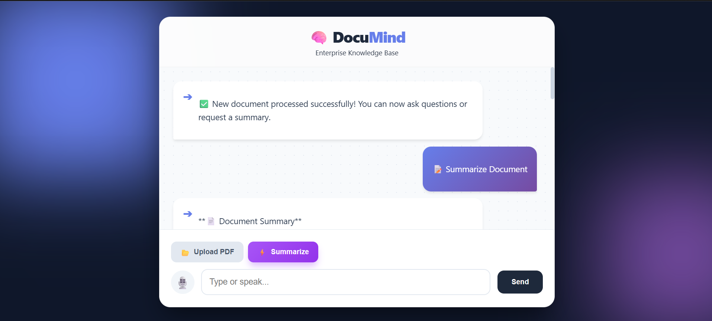
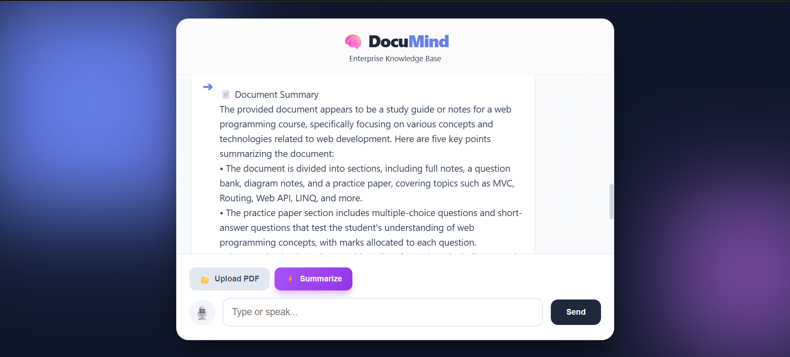

# 🧠 DocuMind | Enterprise AI

DocuMind is an intelligent RAG (Retrieval-Augmented Generation) application built with **Django**. It allows users to upload PDF documents and interact with them using an AI assistant powered by **Groq (Llama 3)**.

## 📸 Screenshots




## 🚀 Features

* **📄 Document Analysis:** Upload PDFs and extract text with automatic page tagging.
* **🤖 AI Chat:** Ask questions about your document and get answers with sources (e.g., "See Page 5").
* **⚡ Summarization:** One-click executive summary generation.
* **🎙️ Voice Interaction:** Speak your questions using built-in speech recognition.
* **🔒 Secure:** Environment variables used for API keys and Django secrets.

## 🛠️ Tech Stack

* **Backend:** Django, Python
* **AI/LLM:** Groq API (Llama-3-70b-versatile)
* **Vector Store:** FAISS (Facebook AI Similarity Search)
* **Orchestration:** LangChain
* **Frontend:** HTML5, CSS3 (Glassmorphism design), JavaScript

## ⚙️ Installation

1.  **Clone the repo:**
    ```bash
    git clone [https://github.com/Raj-128/DocuMind.git](https://github.com/Raj-128/DocuMind.git)
    cd DocuMind
    ```

2.  **Create and activate a virtual environment:**
    ```bash
    python -m venv env
    # Windows
    .\env\Scripts\activate
    # Mac/Linux
    source env/bin/activate
    ```

3.  **Install dependencies:**
    ```bash
    pip install -r requirements.txt
    ```

4.  **Set up environment variables:**
    Create a `.env` file in the root directory and add:
    ```env
    GROQ_API_KEY=your_groq_api_key_here
    SECRET_KEY=your_django_secret_key_here
    ```

5.  **Run the server:**
    ```bash
    python manage.py runserver
    ```

## 🤝 Contributing
Feel free to open issues or submit pull requests.