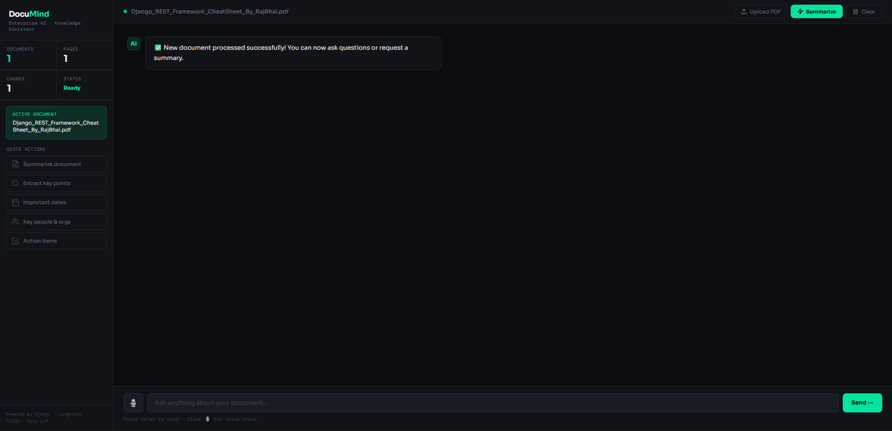
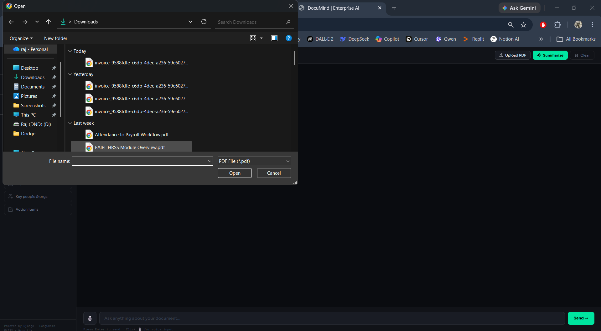
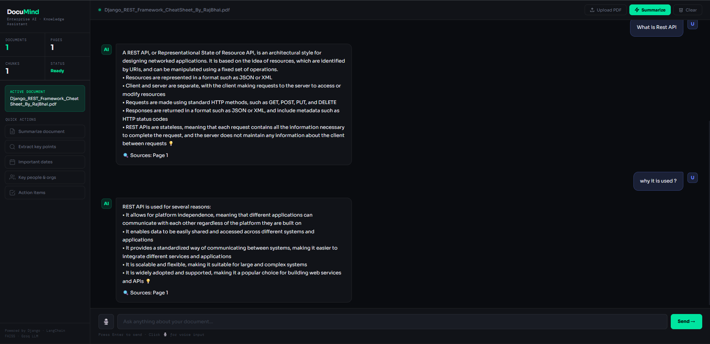
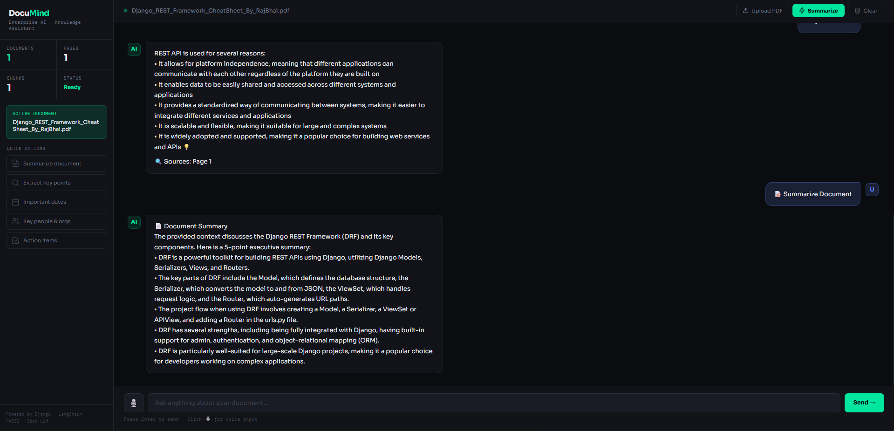
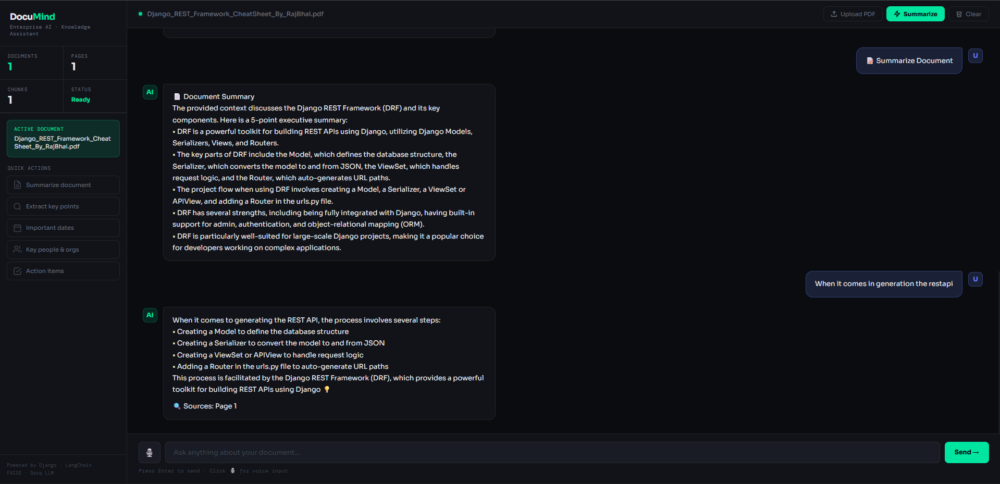

# 🧠 DocuMind – Enterprise AI Knowledge Assistant

<p align="center">
  
</p>

<p align="center">
  An AI-powered document intelligence platform built with Django, LangChain, FAISS, HuggingFace Embeddings, and Groq LLM.
</p>

---

## 🌐 Live Demo

🔗 **Live Application:** https://YOUR-DOCUMIND-RENDER-LINK.onrender.com

Experience DocuMind by uploading PDF documents, generating AI-powered summaries, and interacting with your documents through natural language conversations.

---

## 📖 Overview

DocuMind is an Enterprise AI Knowledge Assistant that transforms static PDF documents into an interactive knowledge base.

Users can upload documents, ask questions in natural language, generate summaries, and receive context-aware answers backed by source citations using a Retrieval-Augmented Generation (RAG) architecture.

Instead of manually searching through lengthy PDFs, users can instantly retrieve relevant information through conversational AI.

---

## 🚀 Key Features

### 📄 Intelligent PDF Processing

* Upload and analyze PDF documents
* Extract content page-by-page
* Automatic text preprocessing and chunking

### 🧠 Retrieval-Augmented Generation (RAG)

* Context-aware question answering
* Semantic search over document content
* Reduced hallucinations through document grounding

### 🔍 Source Citations

* Displays source page references
* Improves transparency and answer reliability
* Enables quick verification of AI-generated responses

### 💬 Conversational Memory

* Maintains recent chat history
* Supports follow-up questions
* Provides a natural conversational experience

### 📑 AI-Powered Document Summaries

* Generate concise executive summaries
* Extract key insights from documents
* Improve document comprehension

### 👥 Session-Based Isolation

* Independent workspace for every visitor
* Separate chat history per session
* Separate document processing per session
* No authentication required

### 🎤 Voice Input Support

* Ask questions using voice commands
* Enhanced accessibility and user interaction

### ⚡ Vector Search with FAISS

* Fast semantic retrieval
* Efficient document indexing
* Scalable document search architecture

---

## 🏗️ System Architecture

PDF Upload

↓

Text Extraction (PyPDF2)

↓

Text Chunking

↓

Embedding Generation

↓

FAISS Vector Store

↓

Similarity Search

↓

Relevant Context Retrieval

↓

Groq LLM

↓

Response Generation + Source Citations

---

## 🛠️ Technology Stack

### Backend

* Python
* Django

### AI & RAG

* LangChain
* Groq (Llama 3.3 70B)
* HuggingFace Embeddings
* FAISS Vector Database

### Document Processing

* PyPDF2

### Frontend

* HTML
* CSS
* JavaScript

### Database

* SQLite

### Environment Management

* Python Dotenv

### Deployment

* Render

---

## 📸 Screenshots

### 🏠 Dashboard


---

### 📄 Document Upload



---

### 💬 AI Question Answering



---

### 📑 AI Document Summary



---

### 🔍 Source Citations



---

## 📂 Project Structure

```text
DocuMind/

├── home/
│   ├── models.py
│   ├── views.py
│   ├── rag_logic.py
│   ├── urls.py
│   └── templates/
│
├── faiss_indexes/
│
├── screenshots/
│   ├── dashboard.png
│   ├── upload.png
│   ├── chat.png
│   ├── summary.png
│   └── sources.png
│
├── Documind/
│   ├── settings.py
│   ├── urls.py
│   ├── wsgi.py
│   └── asgi.py
│
├── manage.py
├── requirements.txt
├── Procfile
└── README.md
```

---

## ⚙️ Installation

### Clone Repository

```bash
git clone https://github.com/Raj-128/DocuMind.git

cd DocuMind
```

### Create Virtual Environment

```bash
python -m venv env
```

### Activate Environment

#### Windows

```bash
env\Scripts\activate
```

#### Linux / Mac

```bash
source env/bin/activate
```

### Install Dependencies

```bash
pip install -r requirements.txt
```

### Configure Environment Variables

Create a `.env` file:

```env
SECRET_KEY=your-secret-key

GROQ_API_KEY=your-groq-api-key
```

### Run Migrations

```bash
python manage.py makemigrations

python manage.py migrate
```

### Start Development Server

```bash
python manage.py runserver
```

---

## 🧠 How It Works

### Step 1 — Upload Document

The user uploads a PDF document.

### Step 2 — Text Extraction

Text is extracted page-by-page while preserving page references.

### Step 3 — Text Chunking

The document is divided into manageable chunks using LangChain's RecursiveCharacterTextSplitter.

### Step 4 — Embedding Generation

Text chunks are converted into vector embeddings using:

```text
sentence-transformers/all-MiniLM-L6-v2
```

### Step 5 — Vector Storage

Embeddings are stored inside a FAISS vector database.

### Step 6 — Question Processing

Users ask questions in natural language.

### Step 7 — Similarity Search

Relevant chunks are retrieved using semantic similarity search.

### Step 8 — AI Response

Retrieved context and conversation history are sent to Groq LLM for response generation.

### Step 9 — Source Citation

Relevant page numbers are displayed alongside the answer.

---

## 🎯 Real-World Use Cases

### HR Knowledge Assistant

Upload:

* Employee Handbook
* Leave Policies
* Insurance Policies

Ask:

* "How many annual leaves are available?"
* "What is the maternity leave policy?"

---

### Technical Documentation Assistant

Upload:

* API Documentation
* System Architecture Guides
* SOP Documents

Ask:

* "How do I deploy the application?"
* "What authentication mechanism is used?"

---

### Research Assistant

Upload:

* Research Papers
* Whitepapers
* Reports

Ask:

* "Summarize the findings."
* "What are the major conclusions?"

---

## 🔒 Security Features

* Environment variable based secret management
* Session-based user isolation
* Independent document processing per session
* Protected API key storage using `.env`

---

## 🔮 Future Enhancements

* Multi-document knowledge base
* PostgreSQL integration
* OCR support for scanned PDFs
* Export conversation history
* Advanced analytics dashboard
* Role-based access control
* Cloud vector database integration
* Multi-language document support

---

## 👨‍💻 Author

### Raj Patil

Master of Information Technology

Python Developer | Django Developer | AI Enthusiast | Full Stack Developer

GitHub: https://github.com/Raj-128

---

## ⭐ Why DocuMind?

Organizations often struggle to retrieve information from large collections of documents.

DocuMind converts static PDFs into an intelligent AI-powered knowledge base, allowing users to retrieve information instantly through natural language conversations.

The project demonstrates modern AI application development using:

* Retrieval-Augmented Generation (RAG)
* Vector Databases
* Large Language Models (LLMs)
* Semantic Search
* Full-Stack Django Development
